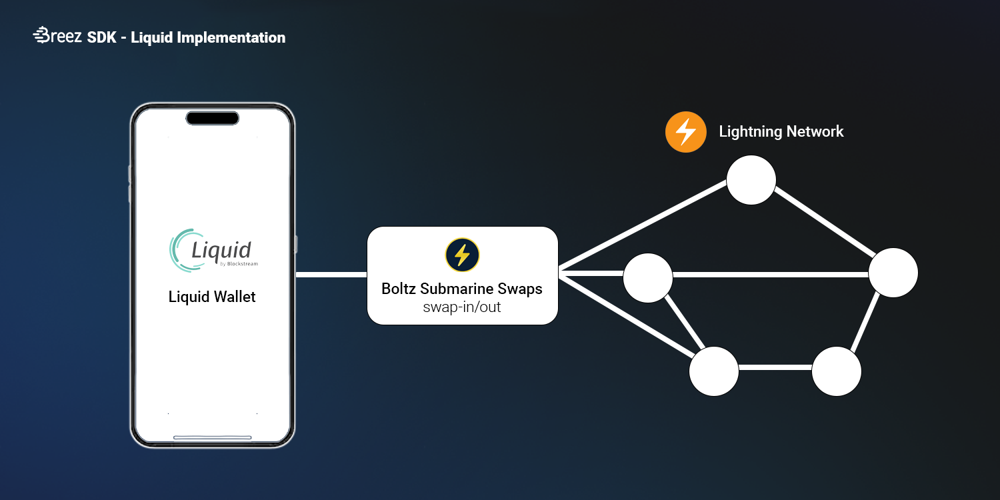

# About the Breez SDK - *Liquid*

## **What Is the Breez SDK?**

The Breez SDK provides developers with an end-to-end solution for integrating self-custodial Lightning payments into their apps and services. It eliminates the need for third-parties, simplifies the complexities of Bitcoin and Lightning, and enables seamless onboarding for billions of users to the future of peer-to-peer payments.

To provide the best experience for their end-users, developers can choose between the following implementations:

- [Breez SDK - *Liquid*](https://sdk-doc-liquid.breez.technology/)
- [Breez SDK - *Greenlight*](https://sdk-doc.breez.technology/)

## **What Is the *Liquid* implementation?**

The *Liquid* implementation is a nodeless Lightning integration. It offers a self-custodial, end-to-end solution for integrating Lightning payments, utilizing the Liquid Network with on-chain interoperability and third-party fiat on-ramps.

**Core Functions**

- **Sending payments** *via protocols such as: bolt11, lnurl-pay, lightning address, btc address.*
- **Receiving payments** *via protocols such as: bolt11, lnurl-withdraw, btc address.*
- **Interacting with a wallet** *e.g. balance, max allow to pay, max allow to receive, on-chain balance.*

**Key Features**

- [x] On-chain interoperability
- [x] LNURL functionality
- [x] Multi-app support
- [x] Multi-device support
- [x] Real-time state backup
- [x] Keys are only held by users
- [x] Fiat on-ramps
- [x] Open-source

## How Does the *Liquid* Implementation Work?

The *Liquid* implementation uses submarine swaps and reverse submarine swaps to send and receive payments, enabling funds to move frictionlessly between the Lightning Network and the Liquid sidechain.

When sending a payment the SDK performs a submarine swap, converting L-BTC from a user’s Liquid wallet into sats on the Lightning Network, and sends them to the recipient. 

When receiving a payment, the SDK performs a reverse submarine swap, converting incoming sats into L-BTC, and then deposits them in the user’s Liquid wallet.

## **Differences Between Implementations**

| *Liquid* Implementation | *Greenlight* Implementation |
| --- | --- |
| Trust profile is with the Liquid sidechain | Pure Lightning Network implementation |
| No channel management or LSP required | Uses Lightning Service Providers (LSPs) for liquidity |
| No setup fees for end-users | Channel open and closing fees |
| Minimum payment size of 1,000 sats | No minimum limit for transactions (after channel opening) |
| Static Liquid on-chain fees | Setup costs are correlated to Bitcoin mining fees |
| Doesn’t require an API key | Requires an API key |

## Pricing

The Breez SDK is **free** for developers. 

## Support

Have a question for the team? Join us on [Telegram](https://t.me/breezsdk) or email us at <contact@breez.technology>.

### Ready to light up your app? [Get started.](https://sdk-doc-liquid.breez.technology/guide/getting_started.html)
